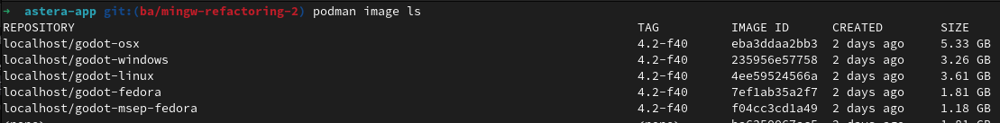

# Building

> IMPORTANT:
> 
> This documentation is intended for developers. End users should download it from our release page or our website.

Clone this repository and all of its submodules by doing `git clone git@github.com:MSEP-one/msep.one.git --recursive` and follow the steps provided bellow.

## Containers

We recomend the usage of containers to build our version of the godot editor and to build msep itself. This will take care of all the dependencies at the cost of using a bit more of disk space.

### Requirements:

- At least 20GB of disk space
- [Podman](https://podman.io/docs/installation)
- git

### First time setup:

1. Clone our [build containers](git@github.com:MSEP-one/build-containers) by running `git clone git@github.com:MSEP-one/build-containers.git`

> IMPORTANT:
>
> If you want to build for macos, you will need to download [Xcode 15.4](https://developer.apple.com/services-account/download?path=/Developer_Tools/Xcode_15.4/Xcode_15.4.xip) with a valid apple developer account and place it inside of the `files` directory of your freshly cloned build-containers repo

2. `cd build-containers`
3. run `./build.sh 4.2 f40`

This process will take a while, it will build all the necessary images locally that are used to build our version of the godot editor and msep itself. 

At the end of the process, you can check the images were generated correctly by examining the result of the command `podman image ls`. You should have something that resembles this:

At this stage, you can just proceed to build godot and subsequently msep for the target you want.

### Building godot editor for linux:
1. Go to the root of msep-app
2. Enter the container by running `podman run -v $PWD:/msep:Z -it godot-linux:4.2-f40`
3. `cd /msep/scripts`
4. `./build_editor_release.linux.sh`
5. Godot editor should be inside of `godot/bin`

You may now be interested in [exporting the project](EXPORT.md)

### Building godot editor for windows:
1. Go to the root of msep-app
2. Enter the container by running `podman run -v $PWD:/msep:Z -it godot-windows:4.2-f40`
3. `cd /msep/scripts`
4. `./build_editor_release.windows.sh`
5. Godot editor should be inside of `godot/bin`

You may now be interested in [exporting the project](EXPORT.md)

### Building godot editor for macos:
1. Go to the root of msep-app
2. Enter the container by running `podman run -v $PWD:/msep:Z -it godot-osx:4.2-f40`
3. `cd /msep/scripts`
4. `./build_editor_release.macos.sh`
5. Godot editor should be inside of `godot/bin`

You may now be interested in [exporting the project](EXPORT.md)

### Building custom templates:

We have helper scripts to build those for all 3 different targets. You should do the same as the steps to build godot editor for a platform:
1. Go to the root of msep-app
2. Enter the container by running `podman run -v $PWD:/msep:Z -it godot-{CONTAINER_NAME}:4.2-f40` where {CONTAINER_NAME} can be `linux`, `windows` or `osx`
3. `cd /msep/scripts`
4. `./generate_export_templates.{TARGET}.sh` where {TARGET}  can be `linux`, `windows` or `macos`

#### Note:
The export templates will be on the `templates/` folder, at the root of the repo.

## Native builds

### Requirements:

- [The requirements for building godot itself for the particular OS](https://docs.godotengine.org/en/stable/contributing/development/compiling)

#### Windows:

> [!WARNING]
>
> MSVC is **NOT** supported

- [MSYS2](https://www.msys2.org/wiki/MSYS2-installation/): Be sure to use the MINGW64 Environment, the steps will assume using that.
- The usual dependencies to [build godot for windows with mingw under msys2](https://docs.godotengine.org/en/stable/contributing/development/compiling/compiling_for_windows.html#compiling-for-windows)
- mingw-w64-x86_64-libtool
- mingw-w64-x86_64-cmake
- mingw-w64-x86_64-autotools
- git

All of those dependencies can be installed with the following command on the msys terminal:
`pacman -S mingw-w64-x86_64-python3-pip mingw-w64-x86_64-gcc  \
    mingw-w64-i686-python3-pip mingw-w64-i686-gcc make mingw-w64-x86_64-libtool mingw-w64-x86_64-cmake mingw-w64-x86_64-autotools git`

Proceed to [Building our version of the godot editor](#Building-our-version-of-the-Godot-Editor)

#### Linux & MacOS:

- cmake
- make
- automake
- libtool

## Building our version of the Godot Editor

We need to pass some parameters to scons for our zeromq custom module, as such, simply calling scons on `godot/` won't work.
- Navigate to the folder `scripts/`
### For the release editor:
- Execute `./build_editor_release.{TARGET}.sh` where {TARGET}  can be `linux`, `windows` or `macos`
### For the debug editor:
- Execute `./build_editor_release.sh`

## Building custom templates:

We have helper scripts to build those for all 3 different targets:

### Windows
Run `generate_windows_export_templates.sh`

### Linux
On linux, you will need [godot`s buildroot](https://github.com/godotengine/buildroot) to make the binaries portable between many linux flavors.

Then, provide the path of the buildroot to the `generate_linuxbsd_export_templates.sh` and call it like so: `TOOLCHAIN_BIN_PATH='~/godot/toolchains/x86_64-godot-linux-gnu_sdk-buildroot/bin' ./generate_linuxbsd_export_templates.sh`

### Mac
on a mac machine, just run `generate_macos_export_templates.sh`
It will generate universal binaries for everything.

### Notes:
The export templates will be on the `templates/` folder, at the root of the repo.

You may now be interested in [exporting the project](EXPORT.md)
