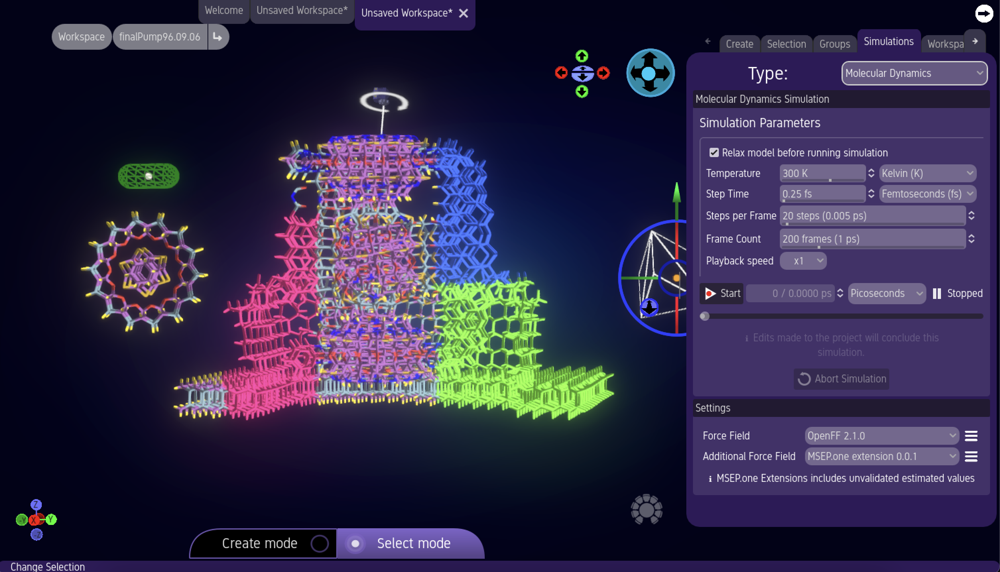

# MSEP.one - Molecular Science and Engineering Platform One

  

## What is MSEP.one?
MSEP.one is a free and open-source software package, developed to help with today's scientific tasks and foster designs for the future of generative nanotechnology.
The easy-to-learn interface makes building and simulating nanomachines fun and simple, perfect for students and hobbyists. Its powerful capabilities and continually expanding feature-set make it an excellent tool for professional researchers and scientists.

  

With its feature-rich molecular editor, MSEP.one lets users design and simulate new nanodevices. Virtual Motors provide power, while Anchors and Springs constrain their motions.
MSEP.one users will quickly and seamlessly share their inventions with an ever-growing community of molecular designers and engineers. The editor makes it easy to compose and save images of new creations.

The opportunities are limitless. The MSEP.one team looks forward to seeing what you invent!

### Free, Open Source, Community Driven 
MSEP.one is completely free and open source under the MIT license.

## Get MSEP.one

You can download MSEP.one releases from our [Github releases page](https://github.com/MSEP-one/msep.one/releases/)

## Documentation
<Get Documentation instructions here>
